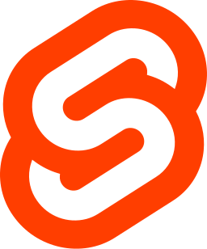

# Aprendiendo Svelte

Curso para aprender **Svelte** basado en proyectos.

A lo largo de este repositorio se muestran los proyectos desarrollados en el curso de _Svelte_.

Los proyectos construidos en el curso son los siguientes:

| Número | Proyecto | Descripción |
| ------ | -------- | ----------- |
| **1** | Guitar LA | Proyecto básico de Svelte para aprender conceptos básicos como la creación de componentes y el uso del estado. |
| **2** | Veterinaria | Proyecto de para hacer un CRUD simple utilizando el estado y el manejo de formularios. |
